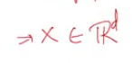
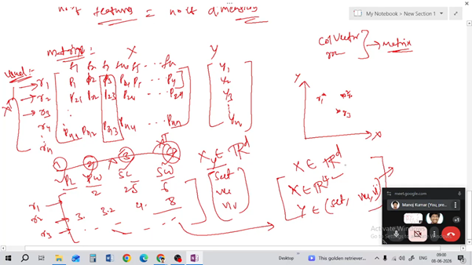
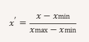
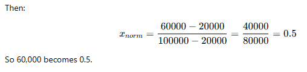
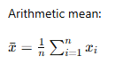
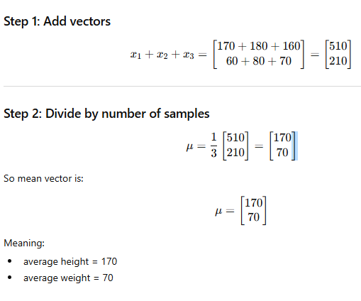
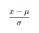
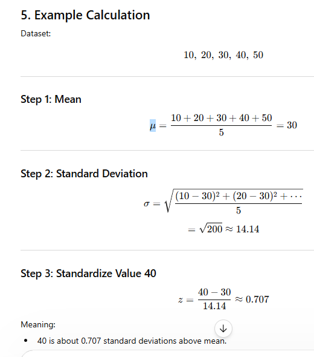
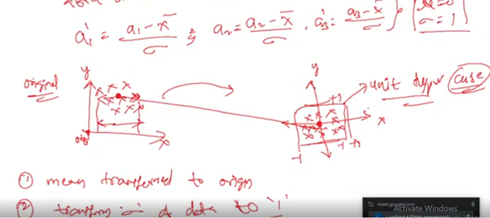

# Dimensionality Reduction

## Univariate Analysis: 
Univariate Analysis is a type of data visualization where we visualize only a single variable at a time. Univariate Analysis helps us to analyze the distribution of the variable present in the data so that we can perform further analysis.  
Example:   sum median


## Bivariate analysis:
Bivariate analysis is the simultaneous analysis of two variables. It explores the concept of the relationship between two variable whether there exists an association and the strength of this association or whether there are differences between two variables and the significance of these differences  
Example: periplot 


**Vector : By default vector is a column vector**       
**Column vector x  row vector xT ** 

### Data representation:

 1)	Independent feature   2) dependent feature 

F1, F2, F3, F4, F5 …….Fn  N dimensions 

 	Number features = number of Dimensions  

Your data set have 100 features it’s like 100 dimensions  



x belongs to real space with d dimensions



### Data normalization:
Feature normalization is a data pre-processing technique used to scale features (variables) so they are on a similar range, making models train more effectively and comparisons fairer.  
Feature normalization adjusts values of different features to a common scale (like 0–1 or mean=0, variance=1) without distorting differences in ranges, ensuring balanced influence in machine learning models.


Different features can have very different ranges.
Example:
Feature	Range
Age	18–60
Salary	20,000–2,000,000
Height	150–190


People often use “normalization” to mean all scaling methods, but technically they differ.  
If we train a model directly:  
•	Salary dominates because its values are huge.   
•	Distance-based algorithms become biased.   
•	Gradient descent becomes slow or unstable.  
Normalization solves this by bringing features to comparable scales  


### formula 



Example  
Suppose:  
•	Minimum salary = 20,000   
•	Maximum salary = 100,000   
•	Current salary = 60,000   
Then:  



```python
from sklearn.preprocessing import MinMaxScaler
import numpy as np

x = np.array([
    [10],
    [20],
    [30],
    [40],
    [50]
])

```


```python
scaler = MinMaxScaler()
#print(scaler)
normalization = scaler.fit_transform(x)
print(normalization)
```

    [[0.  ]
     [0.25]
     [0.5 ]
     [0.75]
     [1.  ]]
    

### Mean vector /Mean matrix: 


```python

```

The mean vector is a way of summarizing the average values of multiple features in a dataset into a single vector.  
Mean vector and mean matrix are extensions of the ordinary arithmetic mean to multidimensional data.  


### Formula 


Suppose we have 3 students:  
Features:  
1.	Height   
2.	Weight   


## Data Standardization:

Data standardization is a pre-processing technique used to transform data so that:  
mean becomes 0 and standard deviation becomes 1  


Formula:



4. Properties After Standardization
After transformation:
Property	        Result
Mean	            0
Standard deviation	1
Variance	        1







```python
from sklearn.preprocessing import StandardScaler
import numpy as np
```


```python
x = np.array([
    [10],
    [20],
    [30],
    [40],
    [50]
])

```


```python
scaler = StandardScaler()
standardized = scaler.fit_transform(x)
print(standardized)
```

    [[-1.41421356]
     [-0.70710678]
     [ 0.        ]
     [ 0.70710678]
     [ 1.41421356]]
    


```python

```
