# Pyplot Tutorial:

**matplotlib.pyplot** is a collection of command style functions that make matplotlib work like MATLAB. 

Each pyplot function makes some change to a figure: e.g., creates a figure, creates a plotting area in a figure, plots some lines in a plotting area, decorates the plot with labels, etc. 


```python
pip install matplotlib

```

    Requirement already satisfied: matplotlib in .\anaconda3\envs\AIML\Lib\site-packages (3.10.8)
    Requirement already satisfied: contourpy>=1.0.1 in .\anaconda3\envs\AIML\Lib\site-packages (from matplotlib) (1.3.3)
    Requirement already satisfied: cycler>=0.10 in .\anaconda3\envs\AIML\Lib\site-packages (from matplotlib) (0.12.1)
    Requirement already satisfied: fonttools>=4.22.0 in .\anaconda3\envs\AIML\Lib\site-packages (from matplotlib) (4.62.1)
    Requirement already satisfied: kiwisolver>=1.3.1 in .\anaconda3\envs\AIML\Lib\site-packages (from matplotlib) (1.5.0)
    Requirement already satisfied: numpy>=1.23 in .\anaconda3\envs\AIML\Lib\site-packages (from matplotlib) (2.4.2)
    Requirement already satisfied: packaging>=20.0 in .\anaconda3\envs\AIML\Lib\site-packages (from matplotlib) (25.0)
    Requirement already satisfied: pillow>=8 in .\anaconda3\envs\AIML\Lib\site-packages (from matplotlib) (12.1.1)
    Requirement already satisfied: pyparsing>=3 in .\anaconda3\envs\AIML\Lib\site-packages (from matplotlib) (3.3.2)
    Requirement already satisfied: python-dateutil>=2.7 in .\anaconda3\envs\AIML\Lib\site-packages (from matplotlib) (2.9.0.post0)
    Requirement already satisfied: six>=1.5 in .\anaconda3\envs\AIML\Lib\site-packages (from python-dateutil>=2.7->matplotlib) (1.17.0)
    Note: you may need to restart the kernel to use updated packages.
    


```python
import matplotlib.pyplot as plt
```


```python
plt.plot([2, 4, 6, 4])
plt.ylabel("Numbers")
plt.xlabel("indicas")
plt.title("myplot")
plt.show()

```


    
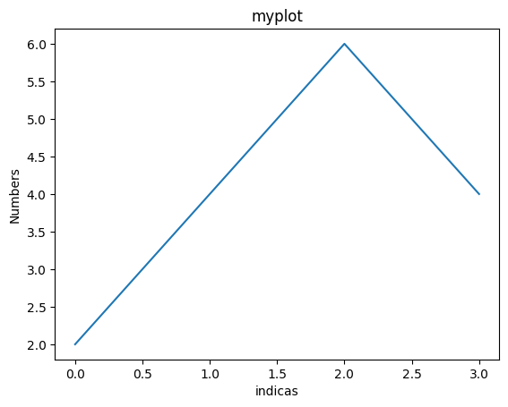
    


If you provide a single list or array to the plot() command, matplotlib assumes it is a sequence of y values, and automatically generates the x values for you. Since python ranges start with 0, the default x vector has the same length as y but starts with 0. Hence the x data are [0,1,2,3].


```python
plt.plot([1,2,3,4], [6,8,10,16])
plt.ylabel("seqence")
plt.xlabel("numbers")
plt.grid()

plt.show
         
```


    <function matplotlib.pyplot.show(close=None, block=None)>


    
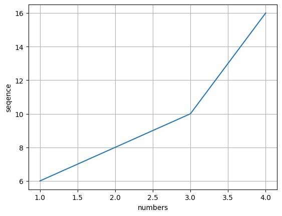
    


For every x, y pair of arguments, there is an optional third argument which is the **format string** that indicates the color and line type of the plot. 


```python
plt.plot([1,2,3,4], [4, 6, 8, 7], 'ro')
plt.grid()
```


    
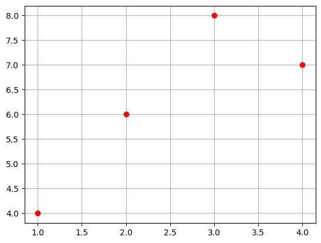
    


## If matplotlib were limited to working with lists, it would be fairly useless for numeric processing. Generally, you will use **numpy arrays**. In fact, all sequences are converted to numpy arrays internally.


```python
import numpy as np
```


```python
t = np.arange(0., 5., 0.2)
t
```


    array([0. , 0.2, 0.4, 0.6, 0.8, 1. , 1.2, 1.4, 1.6, 1.8, 2. , 2.2, 2.4,
           2.6, 2.8, 3. , 3.2, 3.4, 3.6, 3.8, 4. , 4.2, 4.4, 4.6, 4.8])


```python
#blue dashes, red squares and green triangles
plt.plot(t,t**2, 'b--', label='^2')
plt.plot(t,t**2.2, 'rs', label='^2.2')
plt.plot(t,t**2.5, 'g^', label='^2.5')
plt.grid()
plt.legend()
plt.show
```


    <function matplotlib.pyplot.show(close=None, block=None)>


    
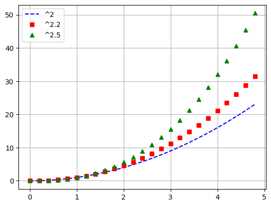
    


# Controlling line properties

**use keyword args**


```python
x = [ 1, 2, 4, 5]
y= [2, 4, 6, 10]
plt.plot(x, y, linewidth=5)
plt.show
```


    <function matplotlib.pyplot.show(close=None, block=None)>


    
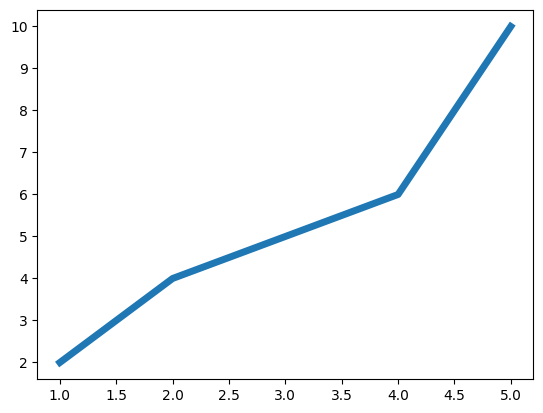
    


```python
x = [ 1, 2, 4, 5]
y= [2, 4, 6, 10]
plt.plot(x, y, linewidth=10)
plt.show
```


    <function matplotlib.pyplot.show(close=None, block=None)>


    
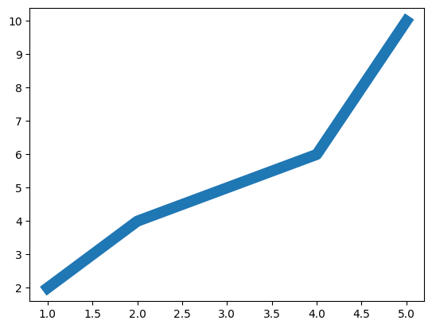
    


** use the setp() **


```python
x1 = [1, 2, 3, 4]
y1 = [1, 4, 9,16]
x2 = [1, 2, 3, 4]
y2 = [2, 4, 6, 8]
lines = plt.plot(x1, y1, x2, y2)
# use keyword args
plt.setp(lines[0], color='r', linewidth=2.0)
plt.setp(lines[1], color='g', linewidth=2.0)
```


    [None, None]


    
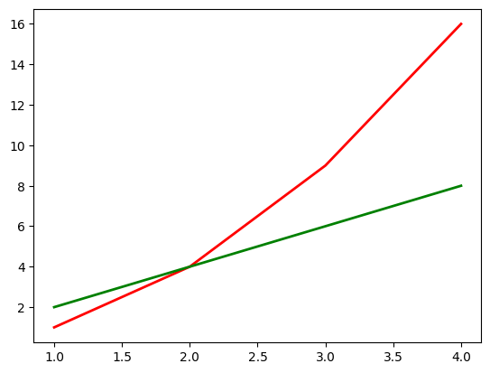
    


```python

```

# working with multiple figures and axes


```python
def f(t):
    return np.exp(-t) * np.cos(2*np.pi*t)

    t1 = np.range(0.0, 5.0, 0.1)
    t2 = np.range(0.0, 5.0, 0.02)
    plt.figure(1)
    # The subplot() command specifies numrows, numcols, 
    # fignum where fignum ranges from 1 to numrows*numcols.
    plt.subplot(211)
    plt.grid()
    plt.plot(t1, f(t1), 'b-')
    plt.subplot(212)
    plt.plot(t2, np.cos(2*np.pi*t2), 'r--')
    plt.show()
```


```python
plt.figure(1) # the first figure
plt.subplot(211) # the first subplot in the first figure
plt.plot([1, 2, 3])
plt.subplot(211)     # the second subplot in the first figure
plt.plot([4, 5, 6])
```


    [<matplotlib.lines.Line2D at 0x208a7c49310>]


    
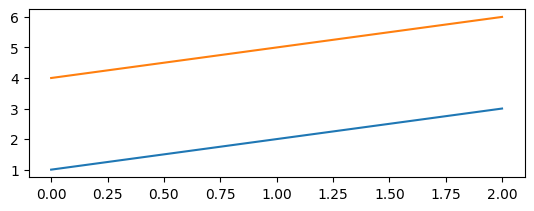
    


```python
plt.figure(2)  # a second figure
```


    <Figure size 640x480 with 0 Axes>


    <Figure size 640x480 with 0 Axes>


```python
plt.plot([4, 5, 6]) # creates a subplot(111) by default
```


    [<matplotlib.lines.Line2D at 0x208a7e10cd0>]


    
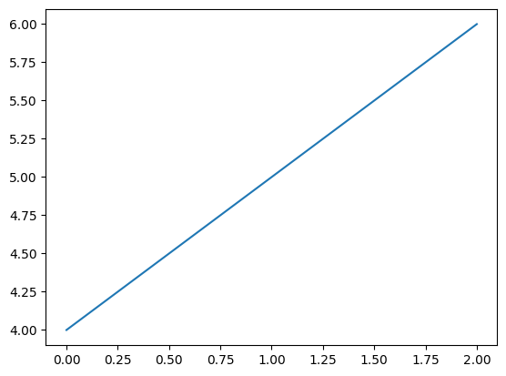
    


```python
plt.figure(1) 
```


    <Figure size 640x480 with 0 Axes>


    <Figure size 640x480 with 0 Axes>


```python
plt.subplot(211)
```


    <Axes: >


    
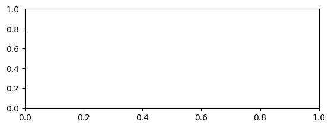
    


```python
plt.title('Easy as 1, 2, 3')
plt.show()
```


    
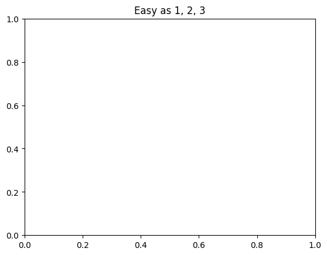
    


# Matplotlib Tutorial by Derek Banas #


```python
pip install pandas 
# https://www.youtube.com/watch?v=wB9C0Mz9gSo
```

    Collecting pandas
      Downloading pandas-3.0.1-cp313-cp313-win_amd64.whl.metadata (19 kB)
    Requirement already satisfied: numpy>=1.26.0 in .\anaconda3\envs\AIML\Lib\site-packages (from pandas) (2.4.2)
    Requirement already satisfied: python-dateutil>=2.8.2 in .\anaconda3\envs\AIML\Lib\site-packages (from pandas) (2.9.0.post0)
    Collecting tzdata (from pandas)
      Downloading tzdata-2025.3-py2.py3-none-any.whl.metadata (1.4 kB)
    Requirement already satisfied: six>=1.5 in .\anaconda3\envs\AIML\Lib\site-packages (from python-dateutil>=2.8.2->pandas) (1.17.0)
    Downloading pandas-3.0.1-cp313-cp313-win_amd64.whl (9.7 MB)
       ---------------------------------------- 0.0/9.7 MB ? eta -:--:--
       ---------------------------------------- 0.0/9.7 MB ? eta -:--:--
       ---------------------------------------- 0.0/9.7 MB ? eta -:--:--
       ---------------------------------------- 0.0/9.7 MB ? eta -:--:--
       - -------------------------------------- 0.3/9.7 MB ? eta -:--:--
       - -------------------------------------- 0.3/9.7 MB ? eta -:--:--
       - -------------------------------------- 0.3/9.7 MB ? eta -:--:--
       - -------------------------------------- 0.3/9.7 MB ? eta -:--:--
       - -------------------------------------- 0.3/9.7 MB ? eta -:--:--
       - -------------------------------------- 0.3/9.7 MB ? eta -:--:--
       - -------------------------------------- 0.3/9.7 MB ? eta -:--:--
       -- ------------------------------------- 0.5/9.7 MB 186.4 kB/s eta 0:00:50
       -- ------------------------------------- 0.5/9.7 MB 186.4 kB/s eta 0:00:50
       -- ------------------------------------- 0.5/9.7 MB 186.4 kB/s eta 0:00:50
       -- ------------------------------------- 0.5/9.7 MB 186.4 kB/s eta 0:00:50
       --- ------------------------------------ 0.8/9.7 MB 233.2 kB/s eta 0:00:39
       --- ------------------------------------ 0.8/9.7 MB 233.2 kB/s eta 0:00:39
       --- ------------------------------------ 0.8/9.7 MB 233.2 kB/s eta 0:00:39
       ---- ----------------------------------- 1.0/9.7 MB 260.5 kB/s eta 0:00:34
       ---- ----------------------------------- 1.0/9.7 MB 260.5 kB/s eta 0:00:34
       ---- ----------------------------------- 1.0/9.7 MB 260.5 kB/s eta 0:00:34
       ----- ---------------------------------- 1.3/9.7 MB 293.8 kB/s eta 0:00:29
       ------ --------------------------------- 1.6/9.7 MB 333.1 kB/s eta 0:00:25
       ------ --------------------------------- 1.6/9.7 MB 333.1 kB/s eta 0:00:25
       ------- -------------------------------- 1.8/9.7 MB 361.8 kB/s eta 0:00:22
       ------- -------------------------------- 1.8/9.7 MB 361.8 kB/s eta 0:00:22
       ------- -------------------------------- 1.8/9.7 MB 361.8 kB/s eta 0:00:22
       -------- ------------------------------- 2.1/9.7 MB 366.4 kB/s eta 0:00:21
       -------- ------------------------------- 2.1/9.7 MB 366.4 kB/s eta 0:00:21
       -------- ------------------------------- 2.1/9.7 MB 366.4 kB/s eta 0:00:21
       --------- ------------------------------ 2.4/9.7 MB 374.3 kB/s eta 0:00:20
       ---------- ----------------------------- 2.6/9.7 MB 401.0 kB/s eta 0:00:18
       ----------- ---------------------------- 2.9/9.7 MB 430.4 kB/s eta 0:00:16
       ------------ --------------------------- 3.1/9.7 MB 455.9 kB/s eta 0:00:15
       ------------- -------------------------- 3.4/9.7 MB 479.4 kB/s eta 0:00:14
       --------------- ------------------------ 3.7/9.7 MB 501.8 kB/s eta 0:00:13
       ---------------- ----------------------- 3.9/9.7 MB 524.6 kB/s eta 0:00:12
       ---------------- ----------------------- 3.9/9.7 MB 524.6 kB/s eta 0:00:12
       ----------------- ---------------------- 4.2/9.7 MB 535.2 kB/s eta 0:00:11
       ------------------ --------------------- 4.5/9.7 MB 557.0 kB/s eta 0:00:10
       ------------------- -------------------- 4.7/9.7 MB 576.7 kB/s eta 0:00:09
       --------------------- ------------------ 5.2/9.7 MB 616.2 kB/s eta 0:00:08
       ---------------------- ----------------- 5.5/9.7 MB 636.4 kB/s eta 0:00:07
       ----------------------- ---------------- 5.8/9.7 MB 652.8 kB/s eta 0:00:07
       ------------------------ --------------- 6.0/9.7 MB 671.3 kB/s eta 0:00:06
       ------------------------- -------------- 6.3/9.7 MB 686.1 kB/s eta 0:00:06
       -------------------------- ------------- 6.6/9.7 MB 699.6 kB/s eta 0:00:05
       ----------------------------- ---------- 7.1/9.7 MB 727.3 kB/s eta 0:00:04
       ------------------------------ --------- 7.3/9.7 MB 743.5 kB/s eta 0:00:04
       -------------------------------- ------- 7.9/9.7 MB 773.0 kB/s eta 0:00:03
       --------------------------------- ------ 8.1/9.7 MB 789.3 kB/s eta 0:00:03
       ----------------------------------- ---- 8.7/9.7 MB 817.4 kB/s eta 0:00:02
       ------------------------------------ --- 8.9/9.7 MB 830.5 kB/s eta 0:00:01
       ------------------------------------- -- 9.2/9.7 MB 844.6 kB/s eta 0:00:01
       ---------------------------------------  9.7/9.7 MB 871.8 kB/s eta 0:00:01
       ---------------------------------------- 9.7/9.7 MB 866.2 kB/s  0:00:11
    Downloading tzdata-2025.3-py2.py3-none-any.whl (348 kB)
    Installing collected packages: tzdata, pandas
    
       ---------------------------------------- 0/2 [tzdata]
       ---------------------------------------- 0/2 [tzdata]
       ---------------------------------------- 0/2 [tzdata]
       -------------------- ------------------- 1/2 [pandas]
       -------------------- ------------------- 1/2 [pandas]
       -------------------- ------------------- 1/2 [pandas]
       -------------------- ------------------- 1/2 [pandas]
       -------------------- ------------------- 1/2 [pandas]
       -------------------- ------------------- 1/2 [pandas]
       -------------------- ------------------- 1/2 [pandas]
       -------------------- ------------------- 1/2 [pandas]
       -------------------- ------------------- 1/2 [pandas]
       -------------------- ------------------- 1/2 [pandas]
       -------------------- ------------------- 1/2 [pandas]
       -------------------- ------------------- 1/2 [pandas]
       -------------------- ------------------- 1/2 [pandas]
       -------------------- ------------------- 1/2 [pandas]
       -------------------- ------------------- 1/2 [pandas]
       -------------------- ------------------- 1/2 [pandas]
       -------------------- ------------------- 1/2 [pandas]
       -------------------- ------------------- 1/2 [pandas]
       -------------------- ------------------- 1/2 [pandas]
       -------------------- ------------------- 1/2 [pandas]
       -------------------- ------------------- 1/2 [pandas]
       -------------------- ------------------- 1/2 [pandas]
       -------------------- ------------------- 1/2 [pandas]
       -------------------- ------------------- 1/2 [pandas]
       -------------------- ------------------- 1/2 [pandas]
       -------------------- ------------------- 1/2 [pandas]
       -------------------- ------------------- 1/2 [pandas]
       -------------------- ------------------- 1/2 [pandas]
       -------------------- ------------------- 1/2 [pandas]
       -------------------- ------------------- 1/2 [pandas]
       -------------------- ------------------- 1/2 [pandas]
       -------------------- ------------------- 1/2 [pandas]
       -------------------- ------------------- 1/2 [pandas]
       -------------------- ------------------- 1/2 [pandas]
       -------------------- ------------------- 1/2 [pandas]
       -------------------- ------------------- 1/2 [pandas]
       -------------------- ------------------- 1/2 [pandas]
       -------------------- ------------------- 1/2 [pandas]
       -------------------- ------------------- 1/2 [pandas]
       -------------------- ------------------- 1/2 [pandas]
       -------------------- ------------------- 1/2 [pandas]
       -------------------- ------------------- 1/2 [pandas]
       -------------------- ------------------- 1/2 [pandas]
       -------------------- ------------------- 1/2 [pandas]
       -------------------- ------------------- 1/2 [pandas]
       -------------------- ------------------- 1/2 [pandas]
       -------------------- ------------------- 1/2 [pandas]
       -------------------- ------------------- 1/2 [pandas]
       -------------------- ------------------- 1/2 [pandas]
       -------------------- ------------------- 1/2 [pandas]
       -------------------- ------------------- 1/2 [pandas]
       -------------------- ------------------- 1/2 [pandas]
       -------------------- ------------------- 1/2 [pandas]
       -------------------- ------------------- 1/2 [pandas]
       -------------------- ------------------- 1/2 [pandas]
       -------------------- ------------------- 1/2 [pandas]
       -------------------- ------------------- 1/2 [pandas]
       -------------------- ------------------- 1/2 [pandas]
       -------------------- ------------------- 1/2 [pandas]
       -------------------- ------------------- 1/2 [pandas]
       -------------------- ------------------- 1/2 [pandas]
       -------------------- ------------------- 1/2 [pandas]
       -------------------- ------------------- 1/2 [pandas]
       -------------------- ------------------- 1/2 [pandas]
       -------------------- ------------------- 1/2 [pandas]
       -------------------- ------------------- 1/2 [pandas]
       -------------------- ------------------- 1/2 [pandas]
       -------------------- ------------------- 1/2 [pandas]
       -------------------- ------------------- 1/2 [pandas]
       -------------------- ------------------- 1/2 [pandas]
       -------------------- ------------------- 1/2 [pandas]
       -------------------- ------------------- 1/2 [pandas]
       -------------------- ------------------- 1/2 [pandas]
       -------------------- ------------------- 1/2 [pandas]
       -------------------- ------------------- 1/2 [pandas]
       -------------------- ------------------- 1/2 [pandas]
       -------------------- ------------------- 1/2 [pandas]
       -------------------- ------------------- 1/2 [pandas]
       -------------------- ------------------- 1/2 [pandas]
       -------------------- ------------------- 1/2 [pandas]
       -------------------- ------------------- 1/2 [pandas]
       -------------------- ------------------- 1/2 [pandas]
       -------------------- ------------------- 1/2 [pandas]
       -------------------- ------------------- 1/2 [pandas]
       -------------------- ------------------- 1/2 [pandas]
       ---------------------------------------- 2/2 [pandas]
    
    Successfully installed pandas-3.0.1 tzdata-2025.3
    Note: you may need to restart the kernel to use updated packages.
    


```python

import matplotlib.pyplot as plt
%matplotlib inline
import numpy as np
import pandas as pd
%reload_ext autoreload
%autoreload 2
```


```python
x_1 = np.linspace(0,5,10)
y_1 = x_1**2 
plt.plot(x_1,y_1)
plt.title("Dya square Chat")
plt.xlabel("Days")
plt.ylabel("Days Square")
```


    Text(0, 0.5, 'Days Square')


    
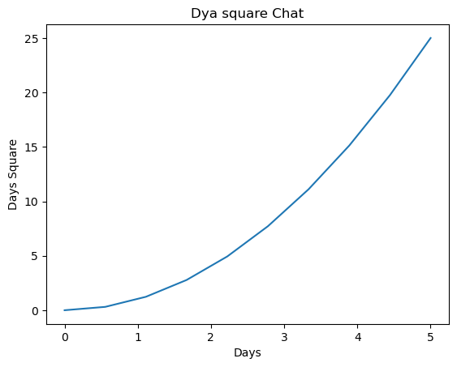
    


 ## **Print Mutilpuleplots**


```python
plt.subplot(1,2,1)
plt.plot(x_1, y_1, 'r')
plt.subplot(1,2,2)
plt.plot(x_1,y_1,'b')
```


    [<matplotlib.lines.Line2D at 0x1dfb9175810>]


    
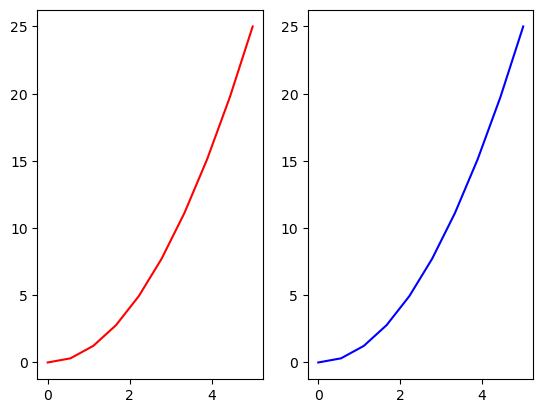
    


```python
#https://www.youtube.com/watch?v=wB9C0Mz9gSo
```

## Using Figure object 


```python
fig = plt.figure(figsize=(5,4),dpi=100)
axes_1 = fig.add_axes([0,0,1,1])
axes_1.set_xlabel('Days')
axes_1.set_ylabel("Days sequre")
axes_1.set_title('Days square Chart')
axes_1.plot(x_1,y_1, label='x/x2')
axes_1.plot(y_1,x_1, label='x2/x')
# upper right : 1 , upper left : 2 , lower left : 3, lower rigth: 4,
axes_1.legend(loc='upper left')
axes_2 = fig.add_axes([0.2,0.2,0.45,0.45])
axes_2.set_xlabel('Days')
axes_2.set_ylabel("Days sequre")
axes_2.set_title('Days square Chart')
axes_2.plot(x_1,y_1, label='x/x2')
axes_2.text(0,4,'message')
```


    Text(0, 4, 'message')


    
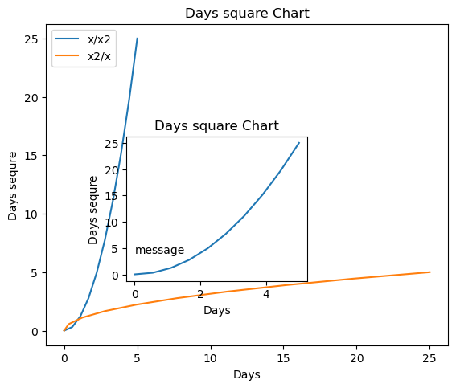
    


# subplot


```python
fig_2, axes_2 = plt.subplots(figsize=(8,2), nrows=1 , ncols=3)
plt.tight_layout()
axes_2[1].set_title('Plot 2')
axes_2[1].set_xlabel('x')
axes_2[1].set_ylabel('X Sequre')
axes_2[1].plot(x_1,y_1)
```


    [<matplotlib.lines.Line2D at 0x1dfbcebe210>]


    
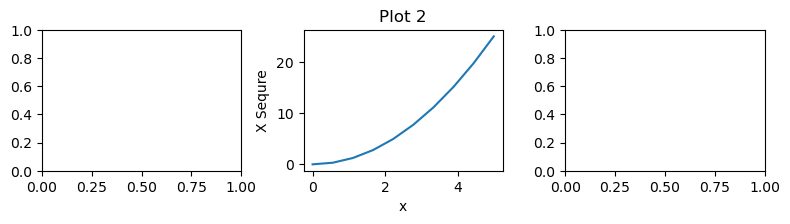
    


# Appearance Option


```python
# Default colors (b: blue, g: green, r: red, c: cyan, m: magenta,
#y: yellow, k: black, w: white)
# color-"0.75" creates a 75% gray
# You can use hexcodes color="#eeefff"
# You can use color names found next like this color="burlywood"
# https://en.wikipedia.org/wiki/Web_colors
# matplotlib.org/3.1.0/gallery/lines_bars_and_markers/linestyles.html
# https://matplotlib.org/3.3.0/api/markers_api.html
# alpha = contrast of the line (graph)
# lw = is line width
# ls = line style
# marker = marker create the dots  graphs # markersize are increae the font 
fig_3 = plt.figure(figsize=(6,4))
axes_3 = fig_3.add_axes([0,0,1,1])
axes_3.plot(x_1,y_1, color='navy', alpha=0.70, lw=5, ls = '-.', marker='o', markersize=20, markerfacecolor='y' ,markeredgecolor='r')

# zoome
axes_3.set_xlim([0,3])
axes_3.set_ylim([0,8])

# grid
axes_3.grid(True, color='0.6')
axes_3.set_facecolor('#FAEBD7')
# backgrud color

```


    
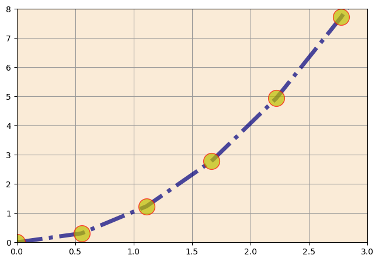
    


# Save the  visulization file


```python
fig_3.savefig('3rd_plot.png')
```


```python

```
