```python
import matplotlib.pyplot as plt
import numpy as np
```


```python
xpoint = np.array([0,6])
ypoint = np.array([0,250])

plt.plot(xpoint,ypoint)
plt.show

```


    <function matplotlib.pyplot.show(close=None, block=None)>


    
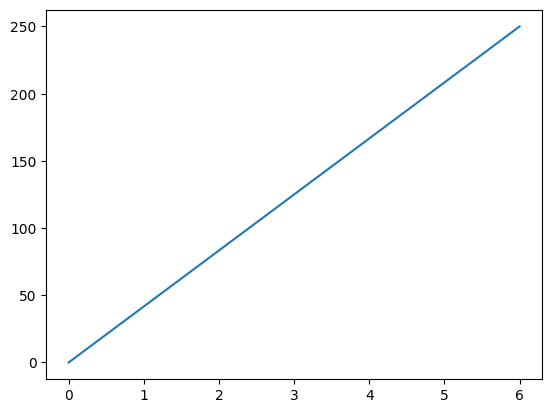
    


```python
xpoint = np.array([0,6,8,9,7,10])
ypoint = np.array([0,250,60,100,150,200])
plt.plot(xpoint,ypoint)
plt.show
```


    <function matplotlib.pyplot.show(close=None, block=None)>


    
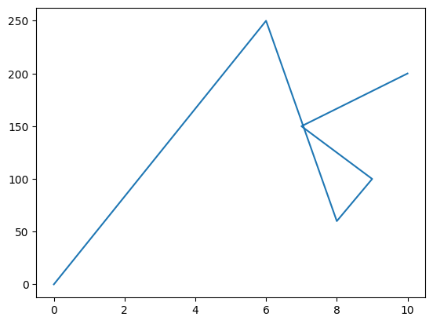
    


```python
xpoint = np.array([0,6,8,9,7,10])
ypoint = np.array([0,250,60,100,150,200])
plt.plot(xpoint,ypoint,'o')
plt.show
```


    <function matplotlib.pyplot.show(close=None, block=None)>


    
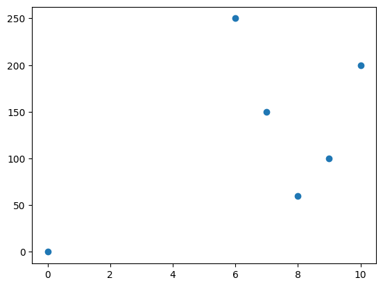
    


## Multiple Points


```python
xpoint = np.array([1,2,3,6])
ypoint = np.array([20,30,40,50,])

xpoint1 = np.array([2,5,6,7])
ypoint1 = np.array([20,40,60,100])

plt.plot(xpoint,ypoint,xpoint1,ypoint1)

```


    [<matplotlib.lines.Line2D at 0x16008a03750>,
     <matplotlib.lines.Line2D at 0x16008a03890>]


    
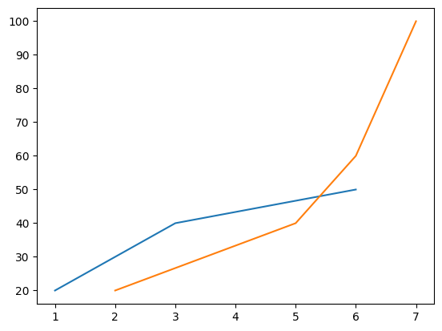
    


## Default X-Points


```python
ypoint = np.array([20,30,40,50,])
plt.plot(ypoint)
```


    [<matplotlib.lines.Line2D at 0x16008ad3390>]


    
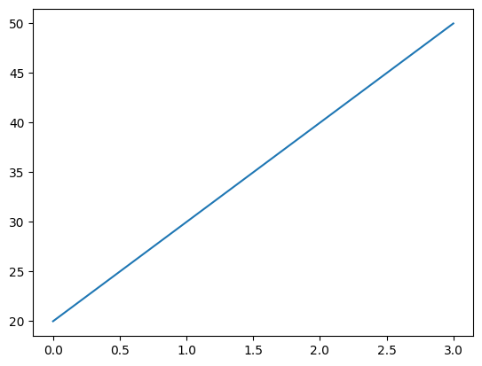
    


## Matplotlib Markers


```python
ypoint = np.array([1,3,4,5,6,7])
plt.plot(ypoint, marker='o')
plt.show
```


    <function matplotlib.pyplot.show(close=None, block=None)>


    

    


```python
ypoint = np.array([1,3,4,5,6,7])
plt.plot(ypoint, marker='x')
plt.show
# we can use "X,+,p,P extra
```


    <function matplotlib.pyplot.show(close=None, block=None)>


    
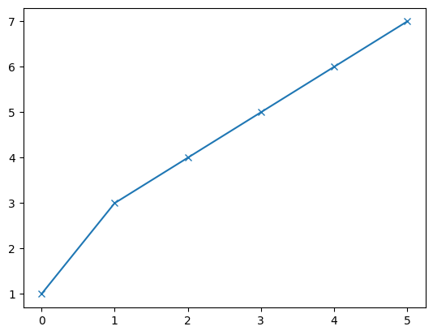
    


```python
ypoint = np.array([1,3,4,5,6,7])
plt.plot(ypoint,'s:b')
plt.show
```


    <function matplotlib.pyplot.show(close=None, block=None)>


    
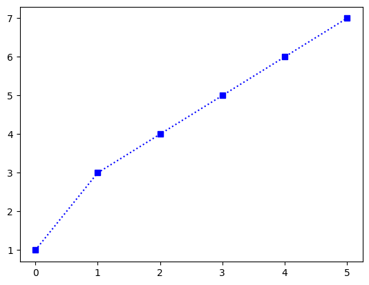
    


```python
# increase the marker size
ypoint = np.array([1,3,4,5,6,7])
plt.plot(ypoint,'s:b',ms=20)
plt.show
```


    <function matplotlib.pyplot.show(close=None, block=None)>


    
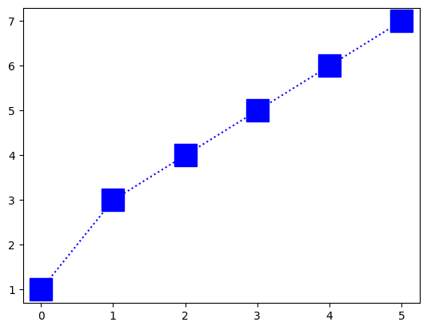
    


```python
# Marker Edge colour 
ypoint = np.array([1,3,4,5,6,7])
plt.plot(ypoint,'s:b',ms=20, mec='r')
plt.show
```


    <function matplotlib.pyplot.show(close=None, block=None)>


    
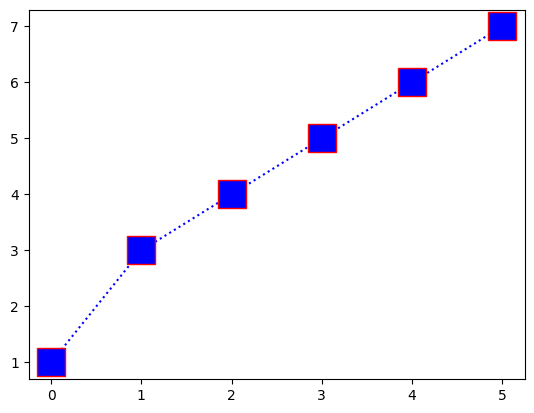
    


```python
# marker face color "mfc"
ypoint = np.array([1,3,4,5,6,7])
plt.plot(ypoint,'s:b',ms=20, mec='r', mfc = 'y')
plt.show
```


    <function matplotlib.pyplot.show(close=None, block=None)>


    
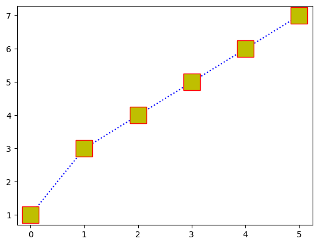
    


```python
# line styles with colour 
ypoint = np.array([1,3,4,5,6,7])
plt.plot(ypoint,'o',ms=20, mec='r', mfc = 'y',ls='--', c='g')
plt.show
```


    <function matplotlib.pyplot.show(close=None, block=None)>


    
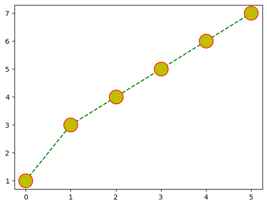
    


```python
# line wirth styles with colour 
ypoint = np.array([1,3,4,5,6,7])
plt.plot(ypoint,'o',ms=20, mec='r', mfc = 'y',ls='--', c='g', lw=5)
plt.show
```


    <function matplotlib.pyplot.show(close=None, block=None)>


    
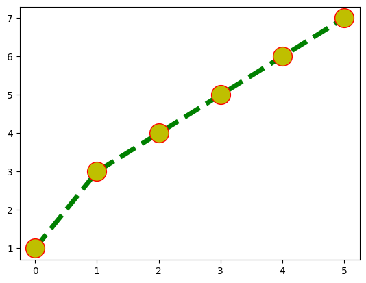
    


## Matplotlib Labels and Title


```python
ypoint = np.array([1,3,4,5,6,7])
plt.plot(ypoint,'o',ms=20, mec='r', mfc = 'y',ls='--', c='g', lw=5)

plt.xlabel('month')
plt.ylabel('viedos')
plt.title("viedo upload")
plt.show           
```


    <function matplotlib.pyplot.show(close=None, block=None)>


    
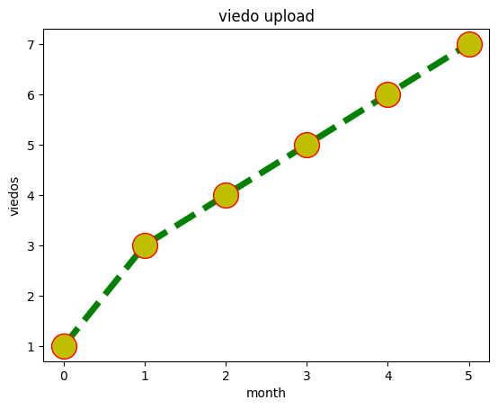
    


```python
# title lift and right side
ypoint = np.array([1,3,4,5,6,7])
plt.plot(ypoint,'o',ms=20, mec='r', mfc = 'y',ls='--', c='g', lw=5)

plt.xlabel('month')
plt.ylabel('viedos')
plt.title("viedo upload",loc="left")
plt.show  
```


    <function matplotlib.pyplot.show(close=None, block=None)>


    
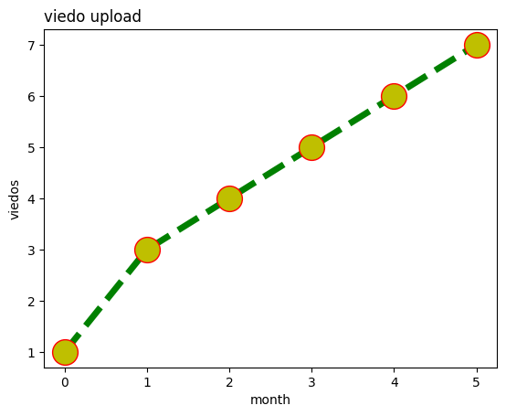
    


```python
# font size 

font1 = {'family':'serif','color':'blue','size':10}
font2 = {'family':'serif','color':'red','size':20}

ypoint = np.array([1,3,4,5,6,7])
plt.plot(ypoint,'o',ms=20, mec='r', mfc = 'y',ls='--', c='g', lw=5)

plt.xlabel('month',fontdict=font1)
plt.ylabel('viedos',fontdict=font1)
plt.title("viedo upload",loc="left",fontdict=font2 )
plt.show  
```


    <function matplotlib.pyplot.show(close=None, block=None)>


    
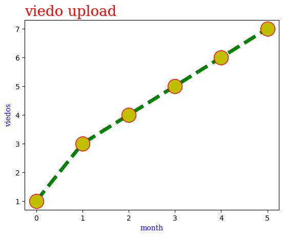
    


```python
# grid
font1 = {'family':'serif','color':'blue','size':10}
font2 = {'family':'serif','color':'red','size':20}

ypoint = np.array([1,3,4,5,6,7])
plt.plot(ypoint,'o',ms=20, mec='r', mfc = 'y',ls='--', c='g', lw=5)

plt.xlabel('month',fontdict=font1)
plt.ylabel('viedos',fontdict=font1)
plt.title("viedo upload",loc="left",fontdict=font2 )
plt.grid()
plt.show  
```


    <function matplotlib.pyplot.show(close=None, block=None)>


    
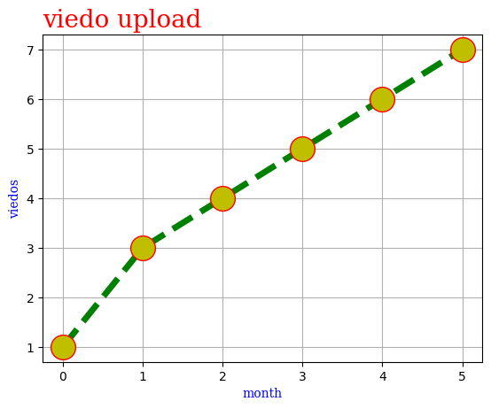
    


```python
# plot1
x = np.array([1,2,3,4])
y= np.array([3,8,1,10])
plt.subplot(1,2,1)
plt.plot(x,y)

# plot 2

x = np.array([0,2,3,4])
y= np.array([10,20,30,40])

plt.subplot(1,2,2)
plt.plot(x,y)

 


```


    [<matplotlib.lines.Line2D at 0x212f6d14190>]


    
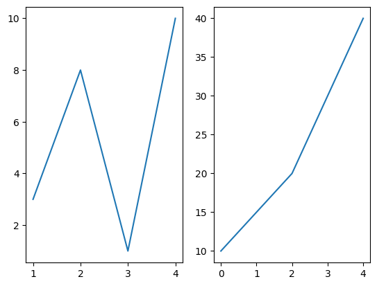
    


```python
x = np.array([0, 1, 2, 3])
y = np.array([3, 8, 1, 10])
plt.subplot(2,3,1)
plt.plot(x,y)
x = np.array([0, 1, 2, 3])
y = np.array([10, 8, 20, 40])
plt.subplot(2,3,2)
plt.plot(x,y)
x = np.array([0, 1, 2, 3])
y = np.array([8, 9, 2, 50])
plt.subplot(2,3,3)
plt.plot(x,y)
x = np.array([0, 1, 2, 3])
y = np.array([20, 30, 60, 50])
plt.subplot(2,3,4)
plt.plot(x,y)

x = np.array([0, 1, 2, 3])
y = np.array([10, 20, 40, 60])
plt.subplot(2,3,5)
plt.plot(x,y)

x = np.array([0, 1, 2, 3])
y = np.array([20, 30, 70, 60])
plt.subplot(2,3,6)
plt.plot(x,y)
```


    [<matplotlib.lines.Line2D at 0x212f8b87750>]


    
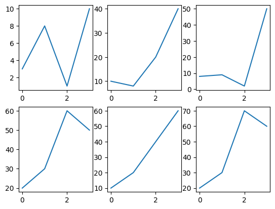
    


## Scatter


```python
x =np.array([1,3,5,7,11,13,15])
y =np.array([2,4,6,10,12,14,16])
plt.scatter(x,y)
plt.show
```


    <function matplotlib.pyplot.show(close=None, block=None)>


    
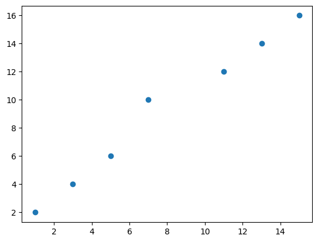
    


```python
# get the multipule graphies
x =np.array([1,3,5,7,11,13,15])
y =np.array([2,4,6,10,12,14,16])
plt.scatter(x,y)
plt.show
x1 =np.array([2,4,6,10,12,14,16])
y1 =np.array([1,3,5,7,11,13,15])
plt.scatter(x1,y1)
plt.show
```


    <function matplotlib.pyplot.show(close=None, block=None)>


    
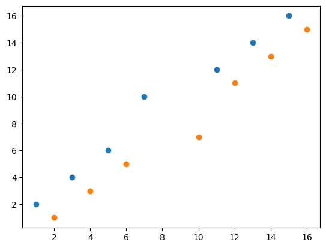
    


## Bars


```python
x = np.array(['jan','feb','mar','apr','may'])
y = np.array([7,10,15,5,10])
plt.bar(x,y)
plt.show()

```


    
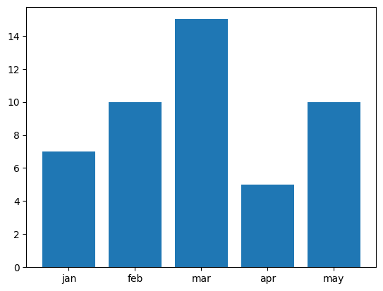
    


```python
# add the color and width 
x = np.array(['jan','feb','mar','apr','may'])
y = np.array([7,10,15,5,10])
plt.bar(x,y,color='green',width=0.5)
plt.show()
```


    
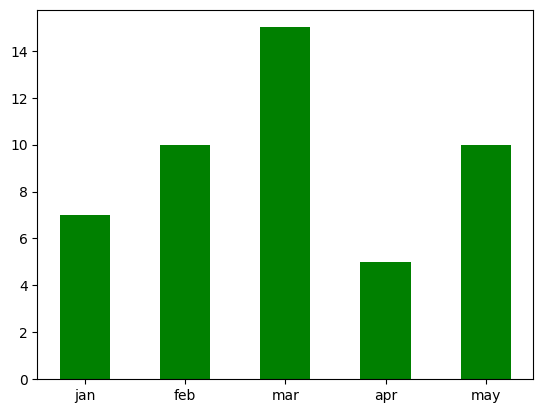
    


```python
# bar harizental
x = np.array(['jan','feb','mar','apr','may'])
y = np.array([7,10,15,5,10])
plt.barh(x,y)
plt.show()

```


    
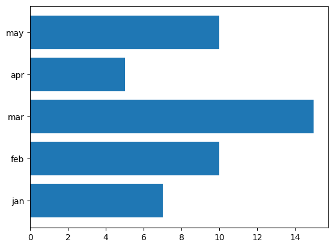
    


```python
# add color and height 
x = np.array(['jan','feb','mar','apr','may'])
y = np.array([7,10,15,5,10])
plt.barh(x,y, color = 'yellow', height=0.5)
plt.show()
```


    
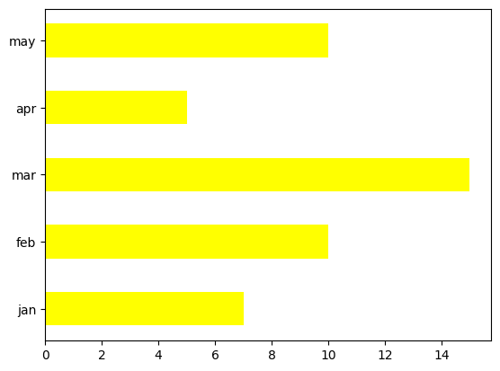
    


## Matplotlib Histograms


```python
# A histogram is a graph showing frequency distributions.
ages = np.array([15,20,30,15,15,40,15, 20, 40,40,50,50,50])
plt.hist(ages)
plt.show
```


    <function matplotlib.pyplot.show(close=None, block=None)>


    
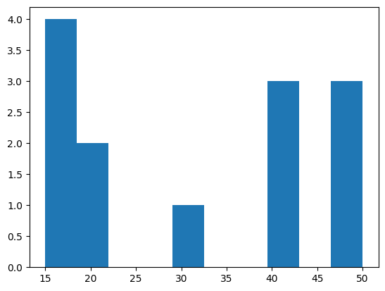
    


## Matplotlib Pie Charts


```python
# Pie Charts.
videos = np.array([10,15,20,30,40,50])
plt.pie(videos)
plt.show()
```


    
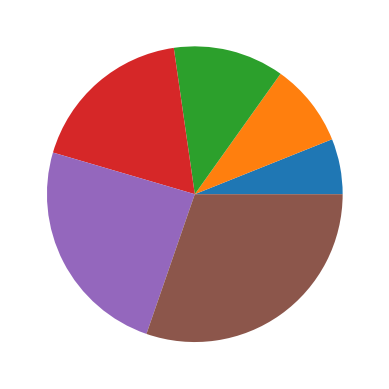
    


```python
# Pie Charts.
#Add labels to the pie chart with the 'labels' parameter.
videos = np.array([10,15,20,30,40])
mylabel = np.array(['apple:10','banana:15','mango:20','grapices:30','watermelon:40'])
plt.pie(videos, labels=mylabel)
plt.show()
```


    
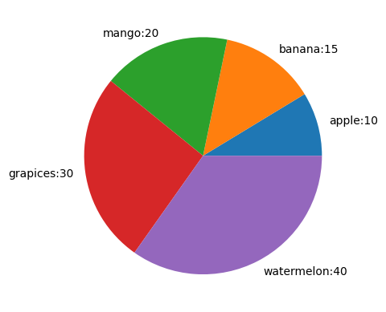
    


```python
# Pie Charts.
#The startangle parameter is defined with an angle in degrees, default angle is 0:
videos = np.array([10,15,20,30,40])
mylabel = np.array(['apple:10','banana:15','mango:20','grapices:30','watermelon:40'])
plt.pie(videos, labels=mylabel,startangle = 30)
plt.show()
```


    
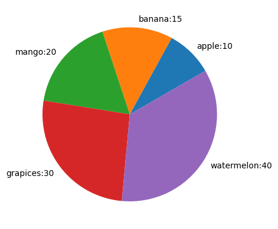
    


```python
#Explode
#Each value represents how far from the center each wedge is displayed:
videos = np.array([10,15,20,30,40])
mylabel = np.array(['apple:10','banana:15','mango:20','grapices:30','watermelon:40'])
myexplod = [0.1,0,0,0.2,0] 
plt.pie(videos, labels=mylabel,startangle = 30, explode = myexplod)
plt.show()
```


    
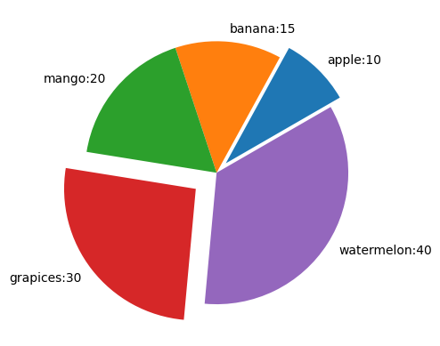
    


```python
#Explode
#add the shadow and legend method
videos = np.array([10,15,20,30,40])
mylabel = np.array(['apple:10','banana:15','mango:20','grapices:30','watermelon:40'])
myexplod = [0.1,0,0,0.2,0] 
plt.pie(videos, labels=mylabel,startangle = 30, explode = myexplod, shadow=True)
plt.legend()
plt.show()
```


    
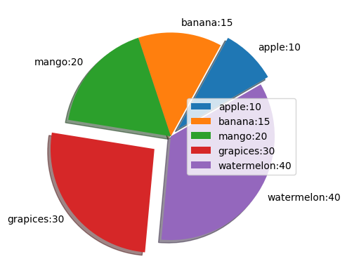
    


```python

```
