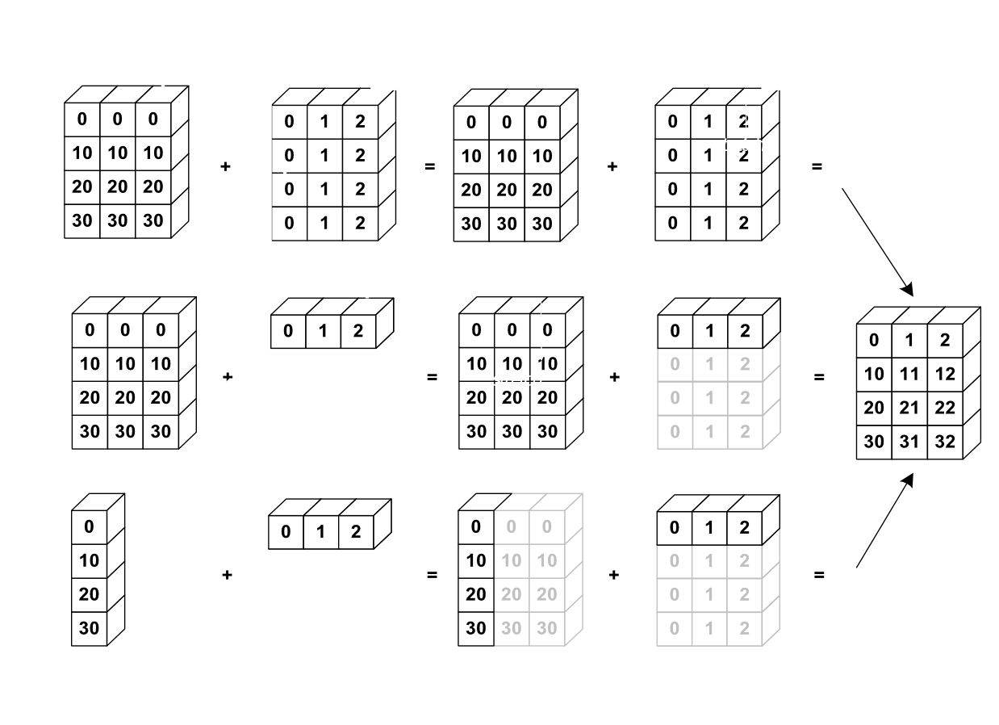

# Elementwise Operations


```python
import numpy as np
```

**1. Basic Operations**

**with scalars**


```python
a = np.array([1,2,3,4,5])
a

```


    array([1, 2, 3, 4, 5])


```python
a+1
```


    array([2, 3, 4, 5, 6])


```python
a ** 2
```


    array([ 1,  4,  9, 16, 25])


**All arithmetic operates elementwise**


```python
b = np.ones(5) +1
print(b)
print(a)

```

    [2. 2. 2. 2. 2.]
    [1 2 3 4 5]
    


```python
a-b
```


    array([-1.,  0.,  1.,  2.,  3.])


```python
a*b
```


    array([ 2.,  4.,  6.,  8., 10.])


```python
# Matrix multiplication
c = np.diag([1,2,3,4])
print( c * c)
print("********************")
print( c.dot(c))
```

    [[ 1  0  0  0]
     [ 0  4  0  0]
     [ 0  0  9  0]
     [ 0  0  0 16]]
    ********************
    [[ 1  0  0  0]
     [ 0  4  0  0]
     [ 0  0  9  0]
     [ 0  0  0 16]]
    

**comparisions**


```python
a = np.array([1,2,3,4,5])
b = np.array([5,2,3,6,7])
a == b
```


    array([False,  True,  True, False, False])


```python
a > b

```


    array([False, False, False, False, False])


```python
#array-wise comparisions

a = np.array([1,2,3,4,5])
b = np.array([1,2,6,7,5])
c = np.array([1,2,3,4,5])

np.array_equal(a,b)
```


    False


```python
np.array_equal(a,c)
```


    True


**Logical Operations**


```python
a = np.array([1, 1, 0, 0], dtype=bool)
b = np.array([1, 0, 1, 0], dtype=bool)

np.logical_or(a,b)
```


    array([ True,  True,  True, False])


```python
np.logical_and(a,b)
```


    array([ True, False, False, False])


**Transcendental functions:**


```python
a = np.arange(5)
print(a)
np.sin(a)
```

    [0 1 2 3 4]
    


    array([ 0.        ,  0.84147098,  0.90929743,  0.14112001, -0.7568025 ])


```python
np.log(a)
```

    C:\Users\Dell\AppData\Local\Temp\ipykernel_13404\176755284.py:1: RuntimeWarning: divide by zero encountered in log
      np.log(a)
    


    array([      -inf, 0.        , 0.69314718, 1.09861229, 1.38629436])


```python
#evaluates e^x for each element in a given input
np.exp(a)

```


    array([ 1.        ,  2.71828183,  7.3890561 , 20.08553692, 54.59815003])


**Shape Mismatch**


```python
a = np.arange(4)
a + np.array([1, 2])
```


    ---------------------------------------------------------------------------

    ValueError                                Traceback (most recent call last)

    Cell In[45], line 2
          1 a = np.arange(4)
    ----> 2 a + np.array([1, 2])
    

    ValueError: operands could not be broadcast together with shapes (4,) (2,) 


# Basic Reductions

**computing sums**


```python
x = np.array([1, 2, 3, 4, 5])
np.sum(x)
```


    np.int64(15)


```python
#sum by rows and by columns

b = np.array([[2,3] , [4,5]])
b
```


    array([[2, 3],
           [4, 5]])


```python
 b.sum(axis=0)  #columns first dimension
```


    array([6, 8])


```python
b.sum(axis=1)
```


    array([5, 9])


**Other reductions**


```python
x = np.array([1, 2, 3, 4,])
x.min()
```


    np.int64(1)


```python
x.max()
```


    np.int64(4)


```python
x.argmin()
```


    np.int64(0)


```python
x.argmax()

```


    np.int64(3)


**Logical Operations**


```python
np.all([True, True, False])
```


    np.False_


```python
np.any([True, False, True])
```


    np.True_


## Note: can be used for array comparisions


```python
a = np.zeros((50, 50))
print(a)
np.any(a != 0)
```

    [[0. 0. 0. ... 0. 0. 0.]
     [0. 0. 0. ... 0. 0. 0.]
     [0. 0. 0. ... 0. 0. 0.]
     ...
     [0. 0. 0. ... 0. 0. 0.]
     [0. 0. 0. ... 0. 0. 0.]
     [0. 0. 0. ... 0. 0. 0.]]
    


    np.False_


```python
np.any(a == 0)
```


    np.True_


```python
np.all(a == a)
```


    np.True_


```python
a = np.array([1, 2, 3, 2])
b = np.array([2, 2, 3, 2])
c = np.array([6, 4, 4, 5])
((a <= b) & (b <= c)).all()
```


    np.True_


```python
x= np.array([1, 2, 3, 1])
y =np.array([[1,2,3], [5, 6, 1]])

x.mean()
```


    np.float64(1.75)


```python
np.median(x)
```


    np.float64(1.5)


```python
np.median(y, axis=-1) 
```


    array([2., 5.])


```python
x.std() 
```


    np.float64(0.82915619758885)


**Example:**

### Data in populations.txt describes the populations of hares and lynxes (and carrots) in northern Canada during 20 years.


```python

#load data into numpy array object
data = np.loadtxt("populations.txt")
```


```python
print(data)
```

    [[ 1900. 30000.  4000. 48300.]
     [ 1901. 47200.  6100. 48200.]
     [ 1902. 70200.  9800. 41500.]
     [ 1903. 77400. 35200. 38200.]
     [ 1904. 36300. 59400. 40600.]
     [ 1905. 20600. 41700. 39800.]
     [ 1906. 18100. 19000. 38600.]
     [ 1907. 21400. 13000. 42300.]
     [ 1908. 22000.  8300. 44500.]
     [ 1909. 25400.  9100. 42100.]
     [ 1910. 27100.  7400. 46000.]
     [ 1911. 40300.  8000. 46800.]
     [ 1912. 57000. 12300. 43800.]
     [ 1913. 76600. 19500. 40900.]
     [ 1914. 52300. 45700. 39400.]
     [ 1915. 19500. 51100. 39000.]
     [ 1916. 11200. 29700. 36700.]
     [ 1917.  7600. 15800. 41800.]
     [ 1918. 14600.  9700. 43300.]
     [ 1919. 16200. 10100. 41300.]
     [ 1920. 24700.  8600. 47300.]]
    


```python
year, harnes, lynxes, carrots = data.T
print(data.T)
```

    [[ 1900.  1901.  1902.  1903.  1904.  1905.  1906.  1907.  1908.  1909.
       1910.  1911.  1912.  1913.  1914.  1915.  1916.  1917.  1918.  1919.
       1920.]
     [30000. 47200. 70200. 77400. 36300. 20600. 18100. 21400. 22000. 25400.
      27100. 40300. 57000. 76600. 52300. 19500. 11200.  7600. 14600. 16200.
      24700.]
     [ 4000.  6100.  9800. 35200. 59400. 41700. 19000. 13000.  8300.  9100.
       7400.  8000. 12300. 19500. 45700. 51100. 29700. 15800.  9700. 10100.
       8600.]
     [48300. 48200. 41500. 38200. 40600. 39800. 38600. 42300. 44500. 42100.
      46000. 46800. 43800. 40900. 39400. 39000. 36700. 41800. 43300. 41300.
      47300.]]
    


```python
data[2:]

```


    array([[ 1902., 70200.,  9800., 41500.],
           [ 1903., 77400., 35200., 38200.],
           [ 1904., 36300., 59400., 40600.],
           [ 1905., 20600., 41700., 39800.],
           [ 1906., 18100., 19000., 38600.],
           [ 1907., 21400., 13000., 42300.],
           [ 1908., 22000.,  8300., 44500.],
           [ 1909., 25400.,  9100., 42100.],
           [ 1910., 27100.,  7400., 46000.],
           [ 1911., 40300.,  8000., 46800.],
           [ 1912., 57000., 12300., 43800.],
           [ 1913., 76600., 19500., 40900.],
           [ 1914., 52300., 45700., 39400.],
           [ 1915., 19500., 51100., 39000.],
           [ 1916., 11200., 29700., 36700.],
           [ 1917.,  7600., 15800., 41800.],
           [ 1918., 14600.,  9700., 43300.],
           [ 1919., 16200., 10100., 41300.],
           [ 1920., 24700.,  8600., 47300.]])


```python
data [:, 1:]

```


    array([[30000.,  4000., 48300.],
           [47200.,  6100., 48200.],
           [70200.,  9800., 41500.],
           [77400., 35200., 38200.],
           [36300., 59400., 40600.],
           [20600., 41700., 39800.],
           [18100., 19000., 38600.],
           [21400., 13000., 42300.],
           [22000.,  8300., 44500.],
           [25400.,  9100., 42100.],
           [27100.,  7400., 46000.],
           [40300.,  8000., 46800.],
           [57000., 12300., 43800.],
           [76600., 19500., 40900.],
           [52300., 45700., 39400.],
           [19500., 51100., 39000.],
           [11200., 29700., 36700.],
           [ 7600., 15800., 41800.],
           [14600.,  9700., 43300.],
           [16200., 10100., 41300.],
           [24700.,  8600., 47300.]])


```python
population = data [:, 1:]
population
```


    array([[30000.,  4000., 48300.],
           [47200.,  6100., 48200.],
           [70200.,  9800., 41500.],
           [77400., 35200., 38200.],
           [36300., 59400., 40600.],
           [20600., 41700., 39800.],
           [18100., 19000., 38600.],
           [21400., 13000., 42300.],
           [22000.,  8300., 44500.],
           [25400.,  9100., 42100.],
           [27100.,  7400., 46000.],
           [40300.,  8000., 46800.],
           [57000., 12300., 43800.],
           [76600., 19500., 40900.],
           [52300., 45700., 39400.],
           [19500., 51100., 39000.],
           [11200., 29700., 36700.],
           [ 7600., 15800., 41800.],
           [14600.,  9700., 43300.],
           [16200., 10100., 41300.],
           [24700.,  8600., 47300.]])


```python
#sample standard deviations
population.axis=0
```


    ---------------------------------------------------------------------------

    AttributeError                            Traceback (most recent call last)

    Cell In[47], line 2
          1 #sample standard deviations
    ----> 2 population.axis=0
    

    AttributeError: 'numpy.ndarray' object has no attribute 'axis' and no __dict__ for setting new attributes


```python
print(data)
```

    [[ 1900. 30000.  4000. 48300.]
     [ 1901. 47200.  6100. 48200.]
     [ 1902. 70200.  9800. 41500.]
     [ 1903. 77400. 35200. 38200.]
     [ 1904. 36300. 59400. 40600.]
     [ 1905. 20600. 41700. 39800.]
     [ 1906. 18100. 19000. 38600.]
     [ 1907. 21400. 13000. 42300.]
     [ 1908. 22000.  8300. 44500.]
     [ 1909. 25400.  9100. 42100.]
     [ 1910. 27100.  7400. 46000.]
     [ 1911. 40300.  8000. 46800.]
     [ 1912. 57000. 12300. 43800.]
     [ 1913. 76600. 19500. 40900.]
     [ 1914. 52300. 45700. 39400.]
     [ 1915. 19500. 51100. 39000.]
     [ 1916. 11200. 29700. 36700.]
     [ 1917.  7600. 15800. 41800.]
     [ 1918. 14600.  9700. 43300.]
     [ 1919. 16200. 10100. 41300.]
     [ 1920. 24700.  8600. 47300.]]
    


```python
data[2:, 1:]
```


    array([[70200.,  9800., 41500.],
           [77400., 35200., 38200.],
           [36300., 59400., 40600.],
           [20600., 41700., 39800.],
           [18100., 19000., 38600.],
           [21400., 13000., 42300.],
           [22000.,  8300., 44500.],
           [25400.,  9100., 42100.],
           [27100.,  7400., 46000.],
           [40300.,  8000., 46800.],
           [57000., 12300., 43800.],
           [76600., 19500., 40900.],
           [52300., 45700., 39400.],
           [19500., 51100., 39000.],
           [11200., 29700., 36700.],
           [ 7600., 15800., 41800.],
           [14600.,  9700., 43300.],
           [16200., 10100., 41300.],
           [24700.,  8600., 47300.]])


```python
population
```


    array([[30000.,  4000., 48300.],
           [47200.,  6100., 48200.],
           [70200.,  9800., 41500.],
           [77400., 35200., 38200.],
           [36300., 59400., 40600.],
           [20600., 41700., 39800.],
           [18100., 19000., 38600.],
           [21400., 13000., 42300.],
           [22000.,  8300., 44500.],
           [25400.,  9100., 42100.],
           [27100.,  7400., 46000.],
           [40300.,  8000., 46800.],
           [57000., 12300., 43800.],
           [76600., 19500., 40900.],
           [52300., 45700., 39400.],
           [19500., 51100., 39000.],
           [11200., 29700., 36700.],
           [ 7600., 15800., 41800.],
           [14600.,  9700., 43300.],
           [16200., 10100., 41300.],
           [24700.,  8600., 47300.]])


```python
population.std(axis=0)
```


    array([20897.90645809, 16254.59153691,  3322.50622558])


```python
np.argmax(population, axis=0)
```


    array([3, 4, 0])


```python
np.argmax(population, axis=1)
```


    array([2, 2, 0, 0, 1, 1, 2, 2, 2, 2, 2, 2, 0, 0, 0, 1, 2, 2, 2, 2, 2])


# Broadcasting

### Basic operations on numpy arrays (addition, etc.) are elementwise

### This works on arrays of the same size.
### Nevertheless, It’s also possible to do operations on arrays of different sizes if NumPy can transform these arrays     so that they all have the same size: this conversion is called broadcasting.

### The image below gives an example of broadcasting:




```python
a = np.arange(0, 40, 10)
a
b = np.tile(np.arange(0, 40, 10), (3,1))
print(b)
print("******************")
b = b.T
print(b)
b.shape
```

    [[ 0 10 20 30]
     [ 0 10 20 30]
     [ 0 10 20 30]]
    ******************
    [[ 0  0  0]
     [10 10 10]
     [20 20 20]
     [30 30 30]]
    


    (4, 3)


```python
c = np.array([1, 2, 3])
c
c.shape
```


    (3,)


```python
b + c
```


    array([[ 1,  2,  3],
           [11, 12, 13],
           [21, 22, 23],
           [31, 32, 33]])


```python
a = np.arange(0, 40, 10)
print(a)
a.shape
```

    [ 0 10 20 30]
    


    (4,)


```python
a = a[:, np.newaxis]
print(a)
```

    [[ 0]
     [10]
     [20]
     [30]]
    


```python
a.shape
```


    (4, 1)


```python
b.shape
```


    (4, 3)


```python
b+c
```


    array([[ 1,  2,  3],
           [11, 12, 13],
           [21, 22, 23],
           [31, 32, 33]])


# Array Shape Manipulation


```python
a = np.array([[1, 2, 3], [4, 5, 6]])
print(a)
a.ravel()
#ravel() is a NumPy function used to "flatten" a multi-dimensional array into a single 1D array
```

    [[1 2 3]
     [4 5 6]]
    


    array([1, 2, 3, 4, 5, 6])


```python
print(a)
#In NumPy, .T is a shorthand attribute used to get the transpose of an array. 
#For a 2D array (matrix), transposing means swapping its rows and columns. If you have an array with shape(2,3) .its transpose will have a shape of(3,2)
a.T
```

    [[1 2 3]
     [4 5 6]]
    


    array([[1, 4],
           [2, 5],
           [3, 6]])


**Reshaping**

The inverse operation to flattening:
## reshape() is a NumPy function used to change the shape (dimensions) of an array without changing its data [1].


```python
print(a)
a.shape
```

    [[1 2 3]
     [4 5 6]]
    


    (2, 3)


```python
b = a.ravel()
b
```


    array([1, 2, 3, 4, 5, 6])


```python
c = b.reshape((2,3))
c
```


    array([[1, 2, 3],
           [4, 5, 6]])


```python
b
```


    array([1, 2, 3, 4, 5, 6])


```python
d = b.reshape(3,2)
d
```


    array([[1, 2],
           [3, 4],
           [5, 6]])


```python
d[0, 0] = 100
d
```


    array([[100,   2],
           [  3,   4],
           [  5,   6]])


**Note and       Beware: reshape may also return a copy!:**


```python
a = np.zeros((3,2))
print(a)
```

    [[0. 0.]
     [0. 0.]
     [0. 0.]]
    


```python
a= a.T
a
```


    array([[0., 0., 0.],
           [0., 0., 0.]])


```python
b = a.T.reshape(3*2)
print(b)
#b[0] = 50
#print(b)
```

    [0. 0. 0. 0. 0. 0.]
    


```python
b[0] = 50
b
```


    array([50.,  0.,  0.,  0.,  0.,  0.])


**Adding a Dimension**

## Indexing with the np.newaxis object allows us to add an axis to an array

## newaxis is used to increase the dimension of the existing array by one more dimension, when used once. Thus,

## 1D array will become 2D array

## 2D array will become 3D array

## 3D array will become 4D array and so on


```python
z = np.array([1, 2, 3])
print(z)
z.shape
```

    [1 2 3]
    


    (3,)


```python
z[:, np.newaxis]
#print(z)
z.shape
```


    (3,)


**Dimension Shuffling**


```python
#a = np.arange(4*3*2).reshape(4, 3, 2)
a = np.arange(4*3*2)
a
```


    array([ 0,  1,  2,  3,  4,  5,  6,  7,  8,  9, 10, 11, 12, 13, 14, 15, 16,
           17, 18, 19, 20, 21, 22, 23])


```python
b = np.arange(4*3*2).reshape(4, 3, 2)
b
```


    array([[[ 0,  1],
            [ 2,  3],
            [ 4,  5]],
    
           [[ 6,  7],
            [ 8,  9],
            [10, 11]],
    
           [[12, 13],
            [14, 15],
            [16, 17]],
    
           [[18, 19],
            [20, 21],
            [22, 23]]])


```python
b[0, 2, 1]
```


    np.int64(5)


```python
b[1, 1, 1]
```


    np.int64(9)


```python
b[3, 2, 0]
```


    np.int64(22)


**Resizing**

**n NumPy, "resizing" refers to changing both the shape and the total number of elements in an array. This is fundamentally different from reshape(), which requires the total number of elements to remain constant


```python
a = np.arange(4)
a.resize((8,))
a

```


    array([0, 1, 2, 3, 0, 0, 0, 0])


```python
b = a
a.resize((4,)) 
```


    ---------------------------------------------------------------------------

    ValueError                                Traceback (most recent call last)

    Cell In[150], line 2
          1 b = a
    ----> 2 a.resize((4,)) 
    

    ValueError: cannot resize an array that references or is referenced
    by another array in this way.
    Use the np.resize function or refcheck=False


**Sorting Data**


```python
a = np.array([[5,4,6], [2,3,2]])
a

```


    array([[5, 4, 6],
           [2, 3, 2]])


```python
b = np.sort(a, axis=0)
print(b)
```

    [[2 3 2]
     [5 4 6]]
    


```python
b= np.sort(a , axis=1)
print(b)
```

    [[4 5 6]
     [2 2 3]]
    

**In NumPy, argsort() is a function that returns the indices that would sort an array, rather than the sorted elements themselves

**Instead of rearranging the actual values, it tells you the "positions" of where the smallest to largest values are located. [1]

How It Works

If you have an array [10, 30, 20]:

The smallest value (10) is at index 0.

The next smallest (20) is at index 2.

The largest (30) is at index 1.

argsort() returns [0, 2, 1]. [3]


```python
#sorting with fancy indexing
a = np.array([4, 3, 1, 2])
a
```


    array([4, 3, 1, 2])


```python

```


```python
j = np.argsort(a)
j
```


    array([2, 3, 1, 0])


```python
a[j]
```


    array([1, 2, 3, 4])


```python

```
